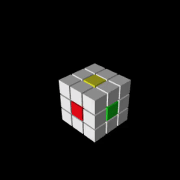

# Rubik's Cube Scanner & Solver
This project is a GUI that allows the user to take a rubik's cube, scan it, and then be given a solution to the Rubik's cube. It recognizes the colors on the Rubik's cube using OpenCV image processing algorithms and gets the solution from a server.
## Instructions
### Dependencies required:
OpenCV <p>
Tkinter <p>
Numpy

Installation using Conda

```
conda install -c anaconda tk
conda install -c conda-forge numpy
conda install -c conda-forge opencv
```
* Connection to the Internet is also needed to solve the Rubik's Cube but scanning can be done without the Internet
* A webcam or camera connected to the device is required for the scanning, but if not, the user can manually enter the Rubik's Cube's color and send it to the server for solving

### Running the code:
After installing the required dependencies, clone the directory RubiksCubeScanner, and run client_gui.py, if the program is ran for the first time, it will require some time to create tables in its directory. 

You can hold your Rubik's Cube in front of your camera to scan the color of each block and if the color scanned is incorrect, you can click a color and enter it into the table manually. 

After all sides of the cube has been entered, click "Solve" to get the solution, and then click "Animate", if you would like to see the Rubik's cube play in action.

## Overview
### A screenshot of the GUI:


The Project consists of three parts:<p></p>

1. Scanning the faces on the Rubik's cube
2. Getting solution to restore the Rubik's cube
3. Creating the animation to display to the user
<p></p>

### 	1. Scanning the faces of the cube

To reduce redundant calculation, the GUI has a ROI (The region bounded by the square in the GUI) which it will search for faces of the cube. In order to scan the faces of the cube, the following procedure is followed:

1. Gray the ROI of the camera image

2. Binarize the gray image to get the contour lines

3. Find the squares in the binary image
	- Use OpenCV **cv2.approxPolyDP()** method to find the shapes in the binary image with four sides(rectangle)
	- Detect if the rectangles detected is a square 
4. If there are 9 squares in the binary image, scan the image and put the corresponding colors in the GUI's cube
	- Determine what color the scanned square is using preset RGB range of each color of the cube.

###   2. Get the solution to restore the Cube
The solving component of this project is taken from the project "RubiksCube-TwophaseSolver" by hkociemba, for more detail, check out the git-hub page <https://github.com/hkociemba/RubiksCube-TwophaseSolver>. Thank you hkociemba for making this project possible.

###   3. Display the solution
To allow the user to visualize the solution of the program, a set of animations for each move is produced for each move symbol in Rubik's Cube language. The move for -R is displayed below:



The Animation is produced by the VPython library. All the cubes are created and animated in the 3-D visualization interface in VPython, and exported to videos using screenrecording.

##Thank You
 Thank you Herbert Kociemba, ([check out his git-hub](https://github.com/hkociemba/RubiksCube-TwophaseSolver)), for the work you have done in creating a solver class for Rubik's Cube under 20 moves, it is fast and efficient and incredible! Without your contribution in [RubiksCube-TwophaseSolver](https://github.com/hkociemba/RubiksCube-TwophaseSolver), this project would not be possible.


